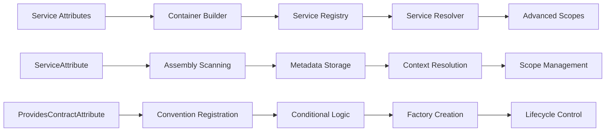
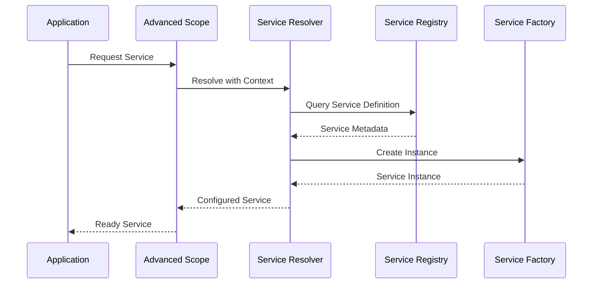

# Zentient Dependency Injection Framework - Complete System Guide

## 🌟 Overview

The **Zentient Dependency Injection Framework** represents a sophisticated, enterprise-grade dependency injection system designed for modern .NET applications. It provides a comprehensive suite of components that work together to deliver exceptional developer experience, performance, and flexibility.

## 🏗️ Architecture Overview

### System Components

```
┌─────────────────────────────────────────────────────────────┐
│                    APPLICATION LAYER                        │
├─────────────────────────────────────────────────────────────┤
│  📊 Service Registry    │  🎯 Service Resolver              │
│  - Service Discovery    │  - Async Resolution               │
│  - Metadata Management  │  - Context Awareness              │
│  - Validation System    │  - Performance Optimization       │
├─────────────────────────┼─────────────────────────────────────┤
│  🏗️ Container Builder   │  📦 Advanced Scopes               │
│  - Fluent Configuration │  - Hierarchical Management        │
│  - Assembly Scanning    │  - Lifecycle Control              │
│  - Convention Support   │  - Diagnostics Integration        │
├─────────────────────────────────────────────────────────────┤
│  🏷️ Service Attributes  │  📋 Service Definitions           │
│  - Declarative Config   │  - Type Definitions               │
│  - Conditional Logic    │  - Interface Contracts            │
│  - Metadata Binding     │  - Builder Patterns               │
├─────────────────────────────────────────────────────────────┤
│                    FOUNDATION LAYER                         │
│  Zentient.Abstractions - Core Interfaces & Types           │
└─────────────────────────────────────────────────────────────┘
```

## 🎯 Component Integration Flow

### 1. Service Registration Flow



### 2. Runtime Resolution Flow



## 📋 Complete Feature Matrix

| Component | Features | Advanced Capabilities |
|-----------|----------|----------------------|
| **Service Attributes** | Declarative registration, Metadata binding | Conditional logic, Validation rules, Priority ordering |
| **Container Builder** | Fluent API, Assembly scanning | Convention-based registration, Interceptors, Decorators |
| **Service Registry** | Service discovery, Metadata management | Validation system, Import/export, Performance monitoring |
| **Service Resolver** | Async resolution, Context awareness | Factory patterns, Generic support, Error handling |
| **Advanced Scopes** | Hierarchical scopes, Lifecycle management | Diagnostics integration, Pooling, Event notifications |

## 🚀 Quick Start Integration

### 1. Basic Setup

```csharp
// Step 1: Create the registry and container builder
var registry = new AdvancedServiceRegistry();
var containerBuilder = new ModernContainerBuilder(registry);

// Step 2: Configure the container
await containerBuilder
    .ConfigureLogging(logging => logging.SetMinimumLevel(LogLevel.Information))
    .ConfigureValidation(validation => validation.EnableConstructorValidation())
    .ConfigureDiagnostics(diagnostics => diagnostics.EnablePerformanceMonitoring())
    .BuildAsync();

// Step 3: Register services using attributes and fluent API
await RegisterServicesAsync(registry);

// Step 4: Build the service provider
var serviceProvider = await BuildServiceProviderAsync(registry);
```

### 2. Service Registration with Attributes

```csharp
// Attribute-based registration
[Service(typeof(IUserService), ServiceLifetime.Scoped)]
[Metadata("Feature", "UserManagement")]
[Tags("business", "core")]
public class UserService : IUserService
{
    // Implementation
}

// Manual registration with conditions
await registry.CreateRegistrationBuilder<IEmailService>()
    .ImplementedBy<SendGridEmailService>()
    .WithLifetime(ServiceLifetime.Singleton)
    .WithTags("email", "external", "production")
    .When(ctx => ctx.IsEnvironment("Production"))
    .RegisterAsync();
```

### 3. Assembly Scanning with Conventions

```csharp
await registry.ScanAssembliesAsync(
    assemblies: new[] { typeof(Program).Assembly },
    configure: scanner => scanner
        .IncludeTypes(type => !type.IsAbstract)
        .WithConventions(conventions =>
        {
            conventions.ForTypesMatching("*Service")
                .RegisterAs(type => type.GetInterfaces().FirstOrDefault() ?? type)
                .UseLifetime(ServiceLifetime.Scoped)
                .WithTags("service", "auto-registered");
        })
        .EnableParallelScanning()
);
```

### 4. Advanced Scope Usage

```csharp
// Create hierarchical scopes
await using var parentScope = await scopeFactory.CreateScopeAsync(options => options
    .WithName("RequestScope")
    .EnableDiagnostics()
    .EnableValidation());

await using var childScope = await scopeFactory.CreateChildScopeAsync(parentScope, options => options
    .WithName("OperationScope")
    .InheritServicesFromParent()
    .EnableIsolation());

// Resolve services with context
var userService = await childScope.GetServiceAsync<IUserService>();
```

## 🔧 Advanced Configuration Patterns

### 1. Environment-Specific Registration

```csharp
// Development services
await registry.CreateRegistrationBuilder<IEmailService>()
    .ImplementedBy<MockEmailService>()
    .When(ctx => ctx.IsEnvironment("Development"))
    .WithTags("email", "mock", "development")
    .RegisterAsync();

// Production services
await registry.CreateRegistrationBuilder<IEmailService>()
    .ImplementedBy<SendGridEmailService>()
    .When(ctx => ctx.IsEnvironment("Production"))
    .When(ctx => !string.IsNullOrEmpty(ctx.GetConfigurationValue<string>("SendGrid:ApiKey")))
    .WithTags("email", "external", "production")
    .RegisterAsync();
```

### 2. Factory-Based Registration

```csharp
// Async factory with initialization
await registry.CreateRegistrationBuilder<IDatabaseService>()
    .UsingAsyncFactory(async provider =>
    {
        var config = provider.GetRequiredService<IConfiguration>();
        var connectionString = config.GetConnectionString("Default");
        var service = new DatabaseService(connectionString);
        await service.InitializeAsync();
        return service;
    })
    .WithLifetime(ServiceLifetime.Scoped)
    .WithMetadata("Provider", "SqlServer")
    .RegisterAsync();
```

### 3. Decorator and Interceptor Patterns

```csharp
// Register base service
await registry.RegisterAsync<IUserRepository, UserRepository>(ServiceLifetime.Scoped);

// Register decorator
await containerBuilder.RegisterDecorator<IUserRepository, CachedUserRepository>(
    condition: ctx => ctx.GetConfigurationValue<bool>("Features:EnableCaching", false));

// Register interceptor
await containerBuilder.RegisterInterceptor<ILoggingInterceptor, PerformanceLoggingInterceptor>(
    selector: type => type.GetCustomAttributes<ProvidesContractAttribute>().Any());
```

## 📊 Monitoring and Diagnostics

### 1. Registry Validation

```csharp
var validationOptions = new ServiceValidationOptions
{
    ValidateConstructorParameters = true,
    ValidateInterfaceImplementation = true,
    ValidateLifetimeCompatibility = true,
    ValidateDependencyAvailability = true
};

var validationReport = await registry.ValidateAsync(validationOptions);

if (!validationReport.IsValid)
{
    foreach (var error in validationReport.Errors)
    {
        logger.LogError("Validation Error: {Message}", error.Message);
    }
}
```

### 2. Performance Monitoring

```csharp
var performanceMetrics = await registry.GetPerformanceMetricsAsync();

logger.LogInformation("Registry Performance: Avg Registration {RegTime}ms, Cache Hit Rate {HitRate:P2}",
    performanceMetrics.AverageRegistrationTime.TotalMilliseconds,
    performanceMetrics.CacheHitRate);
```

### 3. Dependency Analysis

```csharp
var dependencyReport = await registry.AnalyzeDependenciesAsync();

if (dependencyReport.CircularDependencies.Any())
{
    foreach (var circular in dependencyReport.CircularDependencies)
    {
        logger.LogWarning("Circular Dependency: {Description}", circular.Description);
    }
}
```

## 🎯 Event-Driven Monitoring

### 1. Registry Event Subscription

```csharp
// Service registration events
await registry.SubscribeToRegistrationEventsAsync(async eventArgs =>
{
    var service = eventArgs.ServiceDescriptor;
    logger.LogInformation("Service registered: {ServiceType}", service.ServiceType.Name);
    
    if (service.Tags.Contains("critical"))
    {
        await notificationService.NotifyAsync($"Critical service registered: {service.ServiceType.Name}");
    }
});

// Performance threshold events
await registry.SubscribeToPerformanceEventsAsync(async eventArgs =>
{
    if (eventArgs.ExceededThreshold != null)
    {
        logger.LogWarning("Performance threshold exceeded: {ThresholdType}",
            eventArgs.ExceededThreshold.ThresholdType);
    }
});
```

## 🔄 Import/Export and Backup

### 1. Registry Export

```csharp
// Export entire registry
var exportData = await registry.ExportAsync();
await File.WriteAllTextAsync("registry-backup.json", exportData.ToJson());

// Export with filtering
var productionExport = await registry.ExportAsync(criteria => criteria
    .WithTag("production")
    .OfLifetime(ServiceLifetime.Singleton));
```

### 2. Registry Import and Merging

```csharp
var importData = await File.ReadAllTextAsync("registry-backup.json");
var registryData = RegistryData.FromJson(importData);

var importResult = await registry.ImportAsync(registryData, options =>
{
    options.MergeStrategy = RegistryMergeStrategy.ReplaceExisting;
    options.ValidateAfterImport = true;
});

// Merge multiple registries
await mainRegistry.MergeAsync(moduleRegistry, RegistryMergeStrategy.FailOnConflict);
```

## 🏆 Best Practices

### 1. Service Design

- ✅ **Use interfaces** for service contracts
- ✅ **Apply single responsibility** principle
- ✅ **Favor composition** over inheritance
- ✅ **Design for testability** with dependency injection
- ✅ **Use appropriate lifetimes** (Transient for stateless, Scoped for per-request, Singleton for shared state)

### 2. Registration Strategy

- ✅ **Use attributes** for simple, declarative registration
- ✅ **Use fluent API** for complex, conditional registration
- ✅ **Apply conventions** for consistent patterns
- ✅ **Leverage assembly scanning** for automatic discovery
- ✅ **Validate early** during development and testing

### 3. Performance Optimization

- ✅ **Enable caching** for frequently accessed services
- ✅ **Use parallel scanning** for large assemblies
- ✅ **Monitor performance metrics** regularly
- ✅ **Implement proper disposal** patterns
- ✅ **Configure appropriate sampling** rates for diagnostics

### 4. Error Handling

- ✅ **Implement comprehensive validation** rules
- ✅ **Use structured logging** for diagnostics
- ✅ **Handle resolution failures** gracefully
- ✅ **Monitor circular dependencies** proactively
- ✅ **Implement fallback strategies** for critical services

## 📚 Integration Examples

### ASP.NET Core Integration

```csharp
public void ConfigureServices(IServiceCollection services)
{
    // Create Zentient registry
    var registry = new AdvancedServiceRegistry();
    
    // Configure with scanning
    await registry.ScanAssembliesAsync(new[] { typeof(Startup).Assembly });
    
    // Register with ASP.NET Core
    services.AddSingleton<IAdvancedServiceRegistry>(registry);
    
    // Validate configuration
    var validationReport = await registry.ValidateAsync();
    if (!validationReport.IsValid)
    {
        throw new InvalidOperationException("Service registry validation failed");
    }
}
```

### Background Service Integration

```csharp
public class RegistryMonitoringService : BackgroundService
{
    private readonly IAdvancedServiceRegistry _registry;
    private readonly ILogger<RegistryMonitoringService> _logger;

    protected override async Task ExecuteAsync(CancellationToken stoppingToken)
    {
        using var timer = new PeriodicTimer(TimeSpan.FromMinutes(5));
        
        while (await timer.WaitForNextTickAsync(stoppingToken))
        {
            var performance = await _registry.GetPerformanceMetricsAsync();
            var diagnostics = await _registry.GetDiagnosticsAsync();
            
            _logger.LogInformation("Registry Health: {ServiceCount} services, {CacheHitRate:P1} cache hit rate",
                diagnostics.TotalServices, performance.CacheHitRate);
        }
    }
}
```

## 🎯 Conclusion

The Zentient Dependency Injection Framework provides a comprehensive, enterprise-grade solution for modern .NET applications. Key advantages include:

### 🚀 **Developer Experience**
- **Intuitive APIs** - Fluent, discoverable interfaces
- **Rich Diagnostics** - Comprehensive validation and monitoring
- **Flexible Configuration** - Multiple registration approaches
- **Excellent Documentation** - Complete guides and examples

### ⚡ **Performance & Scalability**
- **Async-First Design** - Non-blocking operations throughout
- **Intelligent Caching** - Optimized service resolution
- **Parallel Processing** - Efficient assembly scanning
- **Memory Management** - Proper lifecycle and disposal

### 🏢 **Enterprise Features**
- **Advanced Validation** - Comprehensive dependency analysis
- **Event-Driven Monitoring** - Real-time system insights
- **Import/Export Capabilities** - Configuration management
- **Sophisticated Scoping** - Hierarchical service management

### 🔧 **Flexibility & Extensibility**
- **Multiple Registration Patterns** - Attributes, fluent API, conventions
- **Conditional Logic** - Environment and configuration-aware registration
- **Decorator/Interceptor Support** - AOP and cross-cutting concerns
- **Custom Extensions** - Pluggable architecture

The framework successfully combines sophisticated enterprise features with excellent developer experience, making it suitable for applications ranging from simple services to complex, large-scale enterprise systems.

---

*For detailed implementation examples, see the comprehensive code samples in the `/src/Examples/` and `/src/Integration/` directories.*
